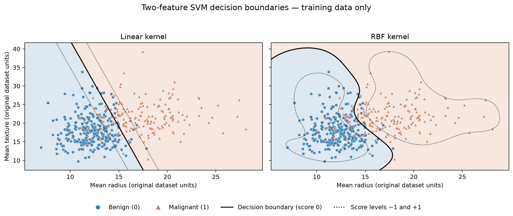

# Breast Cancer Classification with SVM

Machine Learning Assignment 01 by **Sithum Wickramanayaka**, index **269214N**, **Batch 19**.

This project compares Linear and RBF support vector machines on the Breast Cancer Wisconsin Diagnostic dataset. It includes dataset exploration, preprocessing, training-only hyperparameter tuning, evaluation, confusion matrices, ROC curves, and illustrative decision boundaries.

## Project files

- [Executed notebook](assignment/269214N_SVM_Assignment.ipynb)
- [Environment requirements](assignment/requirements.txt)
- [Evaluation metrics](assignment/results/model_comparison.csv)
- [Results and figures](assignment/results/)

## Run the notebook

Open the notebook in Jupyter or upload it to Google Colab, then run all cells in order. For local use:

```sh
python -m pip install -r assignment/requirements.txt
cd assignment
jupyter notebook 269214N_SVM_Assignment.ipynb
```

The dataset is bundled with scikit-learn; no separate data download is needed. The notebook writes figures and metrics to a `results` directory relative to its working directory.

## Method and results

Malignant is encoded as **1** and benign as **0**. All 30 features are used in the main models. The stratified 80–20 split and five-fold training cross-validation use `random_state=42`. StandardScaler is fitted inside each model pipeline to prevent data leakage.

| Metric | Linear SVM | RBF SVM |
| --- | ---: | ---: |
| Accuracy | 0.9825 | 0.9737 |
| Precision | 1.0000 | 1.0000 |
| Recall | 0.9524 | 0.9286 |
| F1 | 0.9756 | 0.9630 |
| ROC-AUC | 0.9964 | 0.9957 |

Precision, recall and F1 refer to malignancy. RBF has the higher training cross-validation ROC-AUC; Linear performs better on this held-out test split. Both confusion matrices are included. These benchmark results do not establish clinical readiness.

## Decision boundaries

The supplementary plots use separate models trained on mean radius and mean texture, with C=1 and RBF gamma='scale'. They illustrate kernel behavior; the main evaluation uses all 30 features.



## Dataset source

[Scikit-learn dataset documentation](https://scikit-learn.org/stable/modules/generated/sklearn.datasets.load_breast_cancer.html). Original dataset: Wolberg, W., Mangasarian, O., Street, N., and Street, W. (1995), [Breast Cancer Wisconsin Diagnostic, UCI](https://doi.org/10.24432/C5DW2B).
